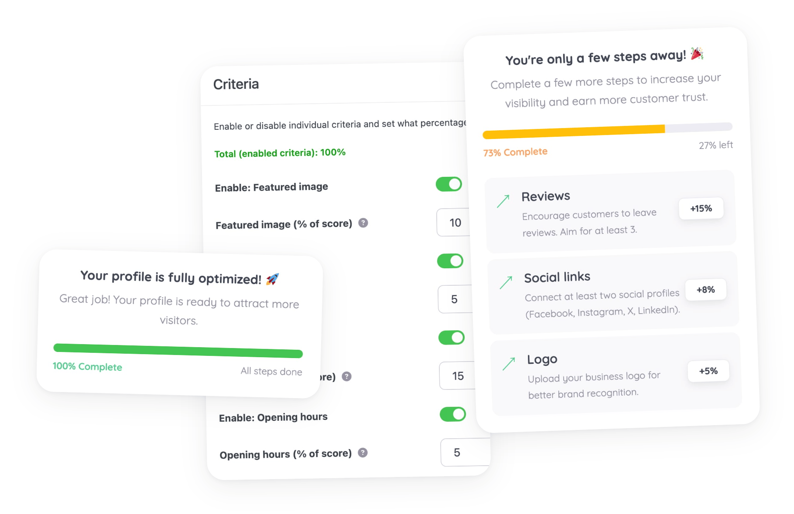

# ListiScore - Listing Health Score for GeoDirectory


[](https://github.com/RachidBray/listiscore/releases/latest)

A free WordPress addon for [GeoDirectory](https://wpgeodirectory.com/?ref=200/) that scores every listing 0-100 based on completeness and quality (a featured image, a real description, contact details, photos, reviews, and more), then shows owners exactly what to fix next for the biggest score gain.

- **Admin column**: a sortable, color-coded Health column on every GeoDirectory listing type's admin list table.
- **Settings tab**: a "Health Score" tab inside GeoDirectory's own settings UI to enable/disable criteria, reweight them, and tune targets and score-band thresholds.
- **Owner widget**: a widget / `[listiscore_health]` shortcode / Gutenberg block showing the score, band, and a recommendations list sorted by potential score percentage gain, visible only to the listing owner and admins.



## For contributors

```bash
composer install
composer lint   # PHPCS / WPCS
composer test   # PHPUnit
```

## Releasing

Version numbers are kept in three places and must match exactly: the plugin header and `LISTISCORE_VERSION` constant in `listiscore.php`, and `Stable tag` in `readme.txt`. To cut a release:

1. Bump all three to the same version and update the changelog in `readme.txt`.
2. Commit, then tag: `git tag v1.2.3 && git push origin v1.2.3`.

Pushing a `v*.*.*` tag triggers [`.github/workflows/release.yml`](.github/workflows/release.yml), which re-runs lint/tests, verifies the tag matches the version declared in the plugin files (and fails the release if it doesn't), builds a clean `.distignore`-respecting ZIP, and publishes a GitHub Release with that ZIP attached and notes generated from the commits since the last tag.
